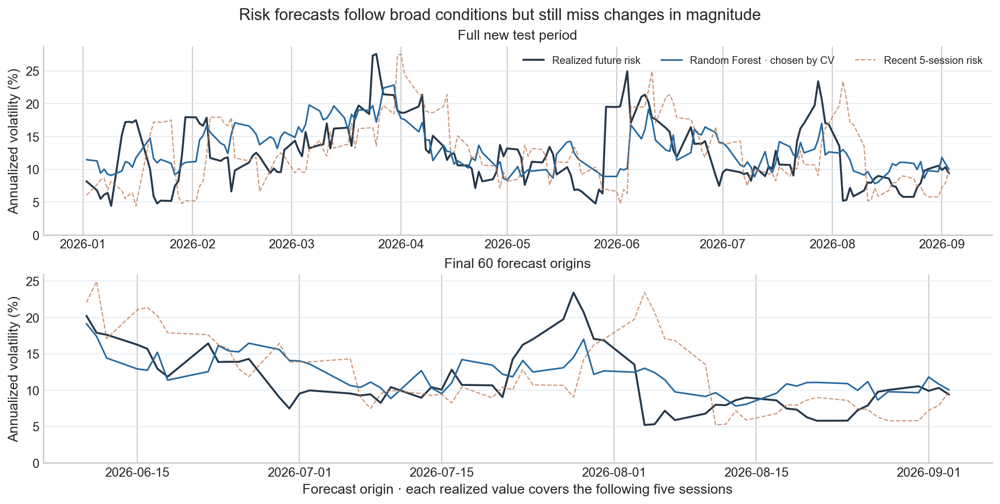

<h1 align="center">SPY Volatility Forecasting</h1>

<p align="center">Estimating how much SPY may move over the next five trading sessions.</p>

<p align="center"><a href="spy_risk_forecasting.ipynb">View the notebook</a> · <a href="reports/spy_risk_forecasting.html">Download the HTML report</a> · <a href="graphs/">See all graphs</a></p>

---

<p align="center"></p>

<p align="center"><em>Forecasts follow broad changes in risk, but sudden moves remain hard to predict.</em></p>

<br>

SPY can have a quiet week followed by a sharp move. We wanted to see whether recent market data could help estimate the size of the next week's moves. This project builds a five-session volatility forecast from SPY, VIX, and three bond and currency ETFs. It compares two models with simple recent-volatility forecasts, then checks the results on a separate 2026 period.

## How the analysis works

1. Check trading dates and build **11 features** using information available at each forecast date.
2. Train Ridge Regression and Random Forest with chronological cross-validation and a five-session gap.
3. Choose the model using development data, then evaluate it once on **169 holdout forecasts** from 2026.
4. Compare errors with recent 5-session and 21-session volatility baselines.

The target is annualized realized volatility over the next five NYSE sessions. It measures the size of price moves, not their direction.

## Results

| Forecast | 2026 holdout RMSE | 2026 holdout MAE |
| --- | ---: | ---: |
| Recent 5-session risk | 6.17 | 4.62 |
| Recent 21-session risk | 5.71 | 4.67 |
| Ridge Regression | 4.22 | 3.20 |
| Random Forest | 4.29 | 3.45 |

Errors are in annualized volatility percentage points. Random Forest was selected by cross-validation before the holdout was evaluated. Ridge had a slightly lower holdout error; the selected model was not changed after seeing that result. The [notebook](spy_risk_forecasting.ipynb) shows the forecast plots, tuning results, and limitations.

## What's in this repository

| Location | Purpose |
| --- | --- |
| [Notebook](spy_risk_forecasting.ipynb) | Complete analysis, code, and saved results |
| [Python runner](scripts/run_report.py) | Rebuilds the notebook, graphs, and HTML report |
| [Graphs](graphs/) | Nine charts from the analysis |
| [Data](data/) | Saved input CSVs for the source audit, development, and holdout |
| [HTML report](reports/spy_risk_forecasting.html) | Download and open in a browser |

The Kaggle CSV is used only to audit the starting data. The forecasting models use the saved market-price snapshots. All model and plotting code is in the notebook; the runner executes it from the repository root.

## Run it yourself

Use Python 3.12. Run these commands in order:

```bash
git clone https://github.com/YB-Yottabyte/SPY-Volatility-Forecasting.git
```

```bash
cd SPY-Volatility-Forecasting
```

```bash
python3.12 -m venv .venv
```

```bash
source .venv/bin/activate
```

```bash
python -m pip install -r requirements.txt
```

```bash
python scripts/run_report.py
```

On Windows PowerShell, replace the environment steps above with:

```powershell
py -3.12 -m venv .venv
```

```powershell
.\.venv\Scripts\Activate.ps1
```

The saved CSVs let the notebook run without a fresh data download.

## Limits

Five future daily returns give a noisy volatility estimate. Forecast outcomes overlap, and the holdout covers only part of 2026. Market data providers can revise historical prices. This is a study of risk forecasts, not a trading strategy.

**Authors:** Sai Rithwik Kukunuri
